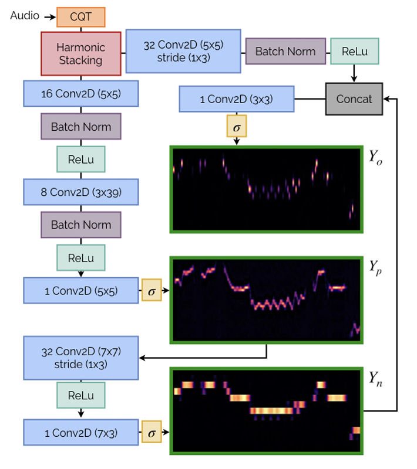

# Objectif du Projet

Ce projet consiste à réimplémenter l'architecture décrite dans l'article intitulé [A Lightweight Instrument-Agnostic Model for Polyphonic Note Transcription and Multi-Pitch Estimation](https://arxiv.org/abs/2203.09893).

L'objectif est de transcrire automatiquement des notes et d'estimer plusieurs hauteurs (multi-pitch) de manière instrument-agnostique, c'est-à-dire que le modèle peut traiter différents types d'instruments sans nécessiter d'adaptations spécifiques.

## Résumé de l'Architecture

Le modèle est une architecture légère basée sur des réseaux neuronaux qui utilise les techniques suivantes :

- **Harmonic Stacking** pour représenter les données audio de manière compacte et informative.
- Trois sorties principales générées par le modèle :
  - **Yp** : Une estimation multi-pitch brute capturant les fréquences présentes.
  - **Yn** : Une représentation quantifiée pour détecter les événements de note.
  - **Yo** : Une estimation des onsets (début des notes), essentielle pour la transcription.

## Choix de la Base de Données

Dans l'article original, l'architecture a été entraînée sur cinq bases de données (et évaluée au total sur sept bases de données). Pour ce projet, nous avons décidé de nous concentrer uniquement sur la base de données **GuitarSet** pour les raisons suivantes :

- **Caractéristiques variées** : GuitarSet contient des enregistrements audio mono et polyphoniques, idéaux pour évaluer un modèle instrument-agnostique.
- **Annotations riches** : Cette base fournit des annotations précises pour les notes et les multi-pitch, permettant de générer les matrices cibles nécessaires (**Yn**, **Yo**, et **Yp**).
- **Utilisation dans l'article** : GuitarSet a été utilisée à la fois pour l'entraînement et les tests dans l'article, ce qui en fait une référence pertinente pour reproduire leurs résultats.

## Préparation de la Base de Données

### Téléchargement des Données

- Les données de GuitarSet sont disponibles sur [Zenodo](https://zenodo.org/record/3371780).
- Téléchargez les fichiers audio "audio_hex-pickup_debleeded" et les annotations correspondantes "annotations".

### Prétraitement des Données

Le dossier **DataSet** contient un fichier notebook intitulé "Basic Processing of GuitarSet and Target Time-Frequency Matrix Generation". Ce notebook explique comment prétraiter les données de GuitarSet et extraire les annotations utiles (notes et multi-pitch). Ces annotations sont utilisées pour générer les matrices binaires cibles suivantes :

- **Yn** : Correspond aux activations des notes (si une note est active).
- **Yo** : Correspond aux onsets des notes.
- **Yp** : Correspond aux activations des hauteurs (f0).

### Organisation des Données

Les données sont organisées en deux sous-dossiers :
1. **audio_hex-pickup_debleeded** : Contient les fichiers audio, qui servent d'entrées au modèle.
2. **Matrices cibles** : Contient les matrices Yn, Yo et Yp générées pour chaque fichier audio, prêtes à être utilisées pour l'entraînement du modèle (avec des segments de 2 secondes).
